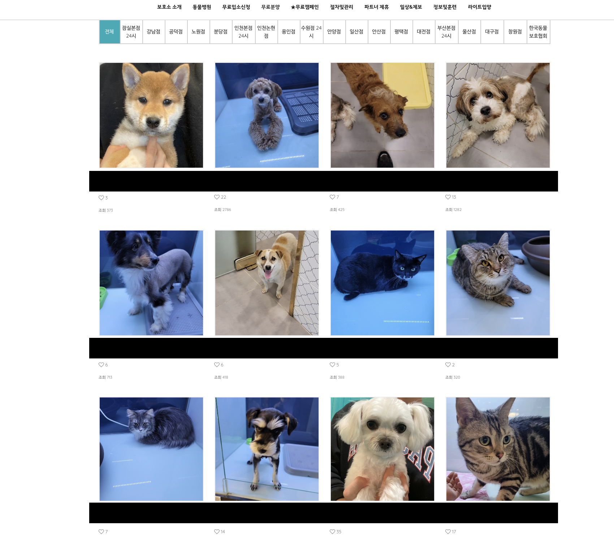

[](https://www.efl.today)

# 생명공감?
생명공감은 유기견 보호소에서 유기견 정보를 관리하고 외부 사람들과 상호작용할 수 있는 웹 애플리케이션입니다.  
P.S. 제가 봉사활동하고 있는 유기견 보호소 이름을 따와서 생명공감이라는 이름을 붙였습니다. :)

# 개발 동기

## 봉사활동만으로 유기견들을 얼마나 도울 수 있을까?
유기견 보호소에서 봉사활동을 할 때마다 드는 생각이 '한정적인 내 몸 하나로 하는 봉사활동이 과연 얼마나 많은 유기견에게 도움을 줄 수 있을까?' 였습니다.

## 사람들과 유기견 보호소를 좀 더 가깝게 만들 순 없을까?
여러 유기견 관련 사이트에서는 잘 정리된 유기견 분양글을 확인할 수 있습니다.  
 | 
:-: | :-:
*사설 유기견 보호소 사이트 분양 글* | *국가 운영 유기견 분양 관련 글*

하지만 분양 관련 글이 대부분을 차지하는 유기견 관련 사이트에서 유기견에 관한 관심을 높이고 입양으로 이어지도록 하기에는 부족하다고 느꼈습니다. 사람들을 좀 더 심리적으로 보호소와 유기견에 가깝게 다가갈 수 있도록 도와주는, 그런 상호작용할 수 있는 웹 애플리케이션이 필요하지 않을까 하는 생각이 들었습니다.  
그렇게 생명공감을 만들게 됐습니다.

# 생명공감에서 할 수 있는 것들
사용자와 관리자의 로그인 방식이 다르고, 앱 안에서 접근 가능한 권한 또한 다릅니다(데이터의 생성, 읽기, 수정, 삭제에 대해서는 이하 CRUD(Create, Read, Update, Delete)라고 지칭하겠습니다).
- **관리자** 접근 권한
  - 개 정보 CRUD
  - 게시글 CRUD (전체 글)
  - 라이브 방송
  - 채팅
- **사용자** 접근 권한
  - 개 정보 확인(READ only)
  - 게시글 CRUD (Read를 제외하고는 본인 글 한정)
  - 라이브 방송 시청
  - 채팅

# Sign-in
|  |
:-:
| *사용자 sign-in 화면(구글 통한 sign-in 구현)* |  

 | 
:-: | :-:
*관리자 authentication 화면(허가되지 않은 접근을 막기 위해*<br/>*한 번의 접근 비밀번호 입력 필요)* | *관리자 sign-in 화면(Local sign-in 구현)*

# 개 정보 CRUD
 | 
:-: | :-:
*Create* | *Read & update*
 | 
*Delete* | *일반 사용자 화면(Read only)*

# 게시글 CRUD
 | 
:-: | :-:
*Create & read* | *Update*
 | 
*Delete* | *User CRUD*

# 채팅
|  |
|:-:|
| *애플리케이션 시연 중 보호소 관계자와 진행된 실제 채팅 장면* |

# 실시간 방송
|  |
|:-:|
*애플리케이션 시연 중 실제 유기견 보호소 라이브 방송 장면*

# 프로젝트 발표 영상
[](https://www.youtube.com/watch?v=F8OHnevCS30&t=3508s)

# Site
https://www.efl.today/

# Github Repositories
## Front-end:
https://github.com/yobe800/empathy-for-life
## Back-end:
https://github.com/yobe800/empathy-for-life-backend

# 개발 기간
2021-05-03 월요일 ~ 2021-05-21 금요일 (**총 3주**)
- 1주차 (2021-05-03 ~ 2021-05-09)
  - Figma를 이용한 Mock-up 구성
  - Lucid chart 이용한 Database schema 구성
  - Notion 이용한 개발 스케줄 구성
  - Static 버전의 애플리케이션 UI 완성
- 2, 3주차 (2021-05-10 ~ 2021-05-21)
  - Client 측 개발에 맞춰서 server 측 end point 개발
  - Mini game 개발 방향을 live streaming 으로 선회
  - Netlify 이용한 client 배포
  - AWS elastic beanstalk 이용한 server 배포

# Brainstorming
## Mockup
[](https://www.figma.com/file/68sETHil0O5LJtUs7LXXXE/%EC%83%9D%EB%AA%85%EA%B3%B5%EA%B0%90?node-id=0%3A1)
## Database schema
[](https://lucid.app/lucidchart/invitations/accept/inv_1b64b341-86fa-4586-98dc-96103169dffe)

# Tech stack
## Front-end
- ES 2015+
  - ES 2015의 [Arrow function expression](https://developer.mozilla.org/en-US/docs/Web/JavaScript/Reference/Functions/Arrow_functions), [template strings](https://developer.mozilla.org/en-US/docs/Web/JavaScript/Reference/Template_literals), [destructuring](https://developer.mozilla.org/en-US/docs/Web/JavaScript/Reference/Operators/Destructuring_assignment), [let](https://developer.mozilla.org/en-US/docs/Web/JavaScript/Reference/Statements/let), [const](https://developer.mozilla.org/en-US/docs/Web/JavaScript/Reference/Statements/const) 등
  - ES 2016의 [Array.prototype.includes](https://developer.mozilla.org/en-US/docs/Web/JavaScript/Reference/Global_Objects/Array/includes)
  - ES 2017의 [Object.values](https://developer.mozilla.org/en-US/docs/Web/JavaScript/Reference/Global_objects/Object/values), [async](https://developer.mozilla.org/en-US/docs/Web/JavaScript/Reference/Global_Objects/AsyncFunction)/[await](https://developer.mozilla.org/en-US/docs/Web/JavaScript/Reference/Operators/await), [trailing commas](https://developer.mozilla.org/en-US/docs/Web/JavaScript/Reference/Trailing_commas) 등
  - ES 2018의 [Object rest/spread properties](https://developer.mozilla.org/en-US/docs/Web/JavaScript/Reference/Operators/Spread_syntax)
  - ES 2020의 [Optional chaining](https://developer.mozilla.org/en-US/docs/Web/JavaScript/Reference/Operators/Optional_chaining)
- [React](https://reactjs.org/)
- [React router](https://reactrouter.com/)
- [Socket.io](https://socket.io/)
- [WebRTC API](https://developer.mozilla.org/en-US/docs/Web/API/WebRTC_API)
- [Canvas API](https://developer.mozilla.org/en-US/docs/Web/API/Canvas_API)

## Back-end
- [Express.js](https://expressjs.com/)
- [Mongo DB Atlas](https://www.mongodb.com/cloud/atlas)
- [Mongoose](https://mongoosejs.com/)
- [Socket.io](https://socket.io/)

# Special gotchas
## Lazy loading
UX를 향상시키기 위해서 Lazy loading을 구현했습니다.  
Lazy loading이란 특정 상황(보통은 사용자가 화면 상하 스크롤로 화면의 특정 위치에 접근할 때)에서 필요한 데이터를 가져오는 것입니다. 이렇게 함으로써 로딩 속도를 개선시켜 UX를 향상시킵니다.  
생명공감에서 게시글을 예로 들면, 처음 게시글 페이지를 열면 5개의 최신 게시글을 fetch 합니다. 이후 사용자가 스크롤을 통해 5 번째 게시글에 접근하면 그다음 5개 게시글을 fetch 해 옵니다.  

|  |
|:-:|
| *게시글 Lazy loading 예제. 스크롤이 바닥에 닿으면 다음 5개 게시글을 fetch해 온다* |  

이런 구현은 다음 코드를 이용해 완성시켰습니다.  

```js
const posts = await Post
  .find(filter)
  .sort({ created_at: -1 })
  .skip(LIMIT_DOCUMENT * pageNumber)
  .limit(LIMIT_DOCUMENT)
  .populate("writer", "user_name")
  .lean();
```

1. `find` 매서드를 통해 우선 DB에 있는 post들을 찾습니다. 인자(argument)인 `filter` 변수는 사용자가 원하는 검색어를 입력했다면 그 검색어가 포함된 post들을 찾고, 아니면 전체 포스트를 대상으로 한다는 값을 담습니다.
2. `sort` 매서드에 인자로 `{ created_at: -1 }` 객체를 전해줌으로써 게시글을 최신 순서로 찾겠다는 것을 정합니다.
3. `skip` 매서드를 통해 이전에 찾았던 도큐먼트가 있다면, 그 도큐먼트 이후를 찾겠다는 것을 정합니다. `pageNumber` 변수에 할당되는 값은 클라이언트 측에서 fetch 요청할 때 query string을 통해 전달해줍니다. `LIMIT_DOCUMENT`는 5라는 값으로 5개의 도큐먼트로 제한해둔 값입니다.
4. `limit` 매서드를 통해 5개의 도큐먼트만을 불러온다는 것을 정합니다.
5. `populate` 매서드를 이용해 post의 writer 속성에 저장된 FK(foreign key)인 사용자 id를 이용해 글쓴이의 이름(`user_name`)과 id(`_id`) 값을 가져옵니다.
6. [`lean` 매서드를 통해 도큐먼트를 POJO(Plain Old Java Object) 형식으로 변환](https://mongoosejs.com/docs/tutorials/lean.html)해서 불러옵니다. POJO형식은 불필요한 mongoose의 도큐먼트(document 관련 매서드를 사용할 필요가 없기 때문에 불필요) 객체 무게를 줄이고 경량화 시킵니다. 이후 post 데이터를 클라이언트 측에 json 형식으로 전달해줍니다.

# 프로젝트를 마치며
## 원 없이 코드를 써보겠어
개인 프로젝트 '생명공감'을 진행하면서 생각한 것이 있습니다. 아무런 제약 없이 내가 하고 싶은 대로 코드를 써보겠다는 것입니다. 그렇다고 인덴팅을 멋대로 하거나 기본 적인 코드 스타일을 마구잡이로 하겠다는 것은 아니었습니다. 😅  
예를 들면 'react에서는 controlled component만 써야할까? 왜?' 라는 의문을 항상 지니고 있었습니다. 그래서 이번에는 controlled component와 uncontrolled component를 각각 만들어 사용해 봤습니다.  
개 정보를 입력해야 하는 곳은 제가 이 때까지 만들었던 form 보다 많은 input을 가지고 있어야 했습니다.  
이 input들을 각각의 state로 관리할수도 있고,
```js
const DogForm = () => {
  const [name, setName] = useState("");
  const [breed, setBreed] = useState("");
  // ...이후 여러 state 추가

  return (
    // ...codes
    <input value={name} onInput={(event) => setName(event.target.value)} />
    <input value={breed} onInput={(event) => setBreed(event.target.value)} />
    // ...codes
  );

};
```
하나의 state를 객체로 만들어서 각각의 input을 관리할수도 있습니다( 이 두 방식은 각 input 요소에 value를 state 값과 연결함으로써 controlled component 방식이 됩니다).  
```js
const DogForm = () => {
  const [form, setForm] = useState({
    name: "",
    breed: "",
    // ...form에 필요한 속성들 추가
  });

  return (
    // ...codes
    <input
      value={form.name}
      onInput={(event) => setForm({ ...form, name: event.target.value })}
    />
    <input
      value={form.breed}
      onInput={(event) => setForm({ ...form, breed: event.target.value })}
    />
    // ...codes
  ); 
};
```
또한 현재 프로젝트의 `DogForm` 컴포넌트에 작성된 코드처럼 uncontrolled 형식으로도 form 데이터를 다룰 수 있습니다.  
Uncontrolled 컴포넌트를 선택한 이유는 세 가지 였습니다.
- 호기심
- 11개의 input을 state로 관리하려니 번거롭다
- [React에서 uncontrolled component로 동작할 수 밖에 없다고 명시](https://reactjs.org/docs/uncontrolled-components.html#the-file-input-tag)된 type="file" input이 섞여 있다

결과적으로 uncontrolled component가 코드를 더 짧고 간결하고 덜 번거롭게 해줬느냐고 묻는다면 '잘 모르겠다'라는 대답을 할 것 같습니다. 왜냐하면 form을 create가 아닌 update 해야 하는 상황에서는 이전에 생성된 값을 각 input에 넣어줘야 했기 때문에 defaultValue와 useRef를 추가해야 했고, 결국 그만큼 코드는 늘어났기 때문입니다.  
위의 예처럼 이번 프로젝트는 코드를 작성하면서 어떤 일관된 형식(?)에 얽매이지 않고 자유분방하게 코드를 작성해 봤습니다.  
이런 방식의 작업은 코드를 쓰는 즐거움을 주고 코드 작성에 대한 창의성을 높여준다고 느꼈습니다. 반면에 공동 작업으로 진행해야 하는 프로젝트였다면 동료에게 불편한 코드들을 제공해줄 소지가 다분하다고 느꼈습니다. 형식에 얽매임이 없기 때문에 코드 전체적으로 통일성이 떨어지고 읽기가 그만큼 힘들 수도 있기 때문이죠. 😨  

## 모든 건 trade-off
React를 쓰면 react가 만들어 둔 형식들을 이용해 빠르고 편리하게 코드를 작성할 수 있지만, 그 틀 안에서 움직여야 해서 제약이 발생할 수밖에 없습니다.  
팀 프로젝트는 함께 작업하기에 서로 정보를 공유하고 토론하면서 보다 개선된 코드와 UX, UI 방향을 찾는 즐거움이 있고 팀원 간 상호 보완적으로 작업할 수 있지만, 그만큼 어느 정도 틀을 정하고 서로 지키면서 작업해야 하는 억압감(?)도 느껴야 합니다.  
개인 프로젝트는 혼자 하므로 자유분방하게 작업할 수 있지만, 책임지지 못하는 자유는 방임된 코드를 쓰게 되고 어쩌면 시간이 흐른 후 미래의 나조차 읽지 못하는 코드를 작성할 수도 있습니다.  
두서 없이 말을 정리했습니다만, 결국 어떤 상황에서든 장단점은 있기 때문에 주어진 것에서 내가 할 수 있는 최선을 다하는 것이 중요하지 않을까 싶습니다.  
